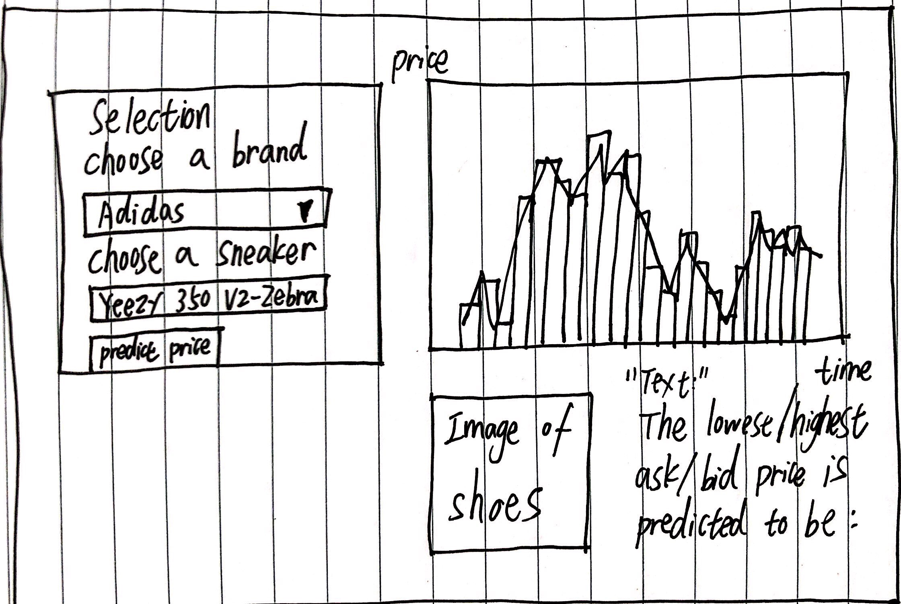

```{r set-options, include = FALSE}
# Sets default chunk options
knitr::opts_chunk$set(
  # Figures/Images will be centered
  fig.align = "center", 
  # Code will not be displayed unless `echo = TRUE` is set for a chunk
  echo = FALSE,
  # Messages are suppressed
  message = FALSE,
  # Warnings are suppressed
  warning = FALSE
)
```

```{r install-and-load-packages, include = FALSE}
# All packages needed should be loaded in this chunk
pkg_list = c('knitr', 'kableExtra', 'magrittr')

# Determine what packages are NOT installed already.
to_install_pkgs = pkg_list[!(pkg_list %in% installed.packages()[,"Package"])]

# Install the missing packages
if(length(to_install_pkgs)) {
  install.packages(to_install_pkgs, repos = "https://cloud.r-project.org")
}

# Load all packages
sapply(pkg_list, require, character.only = TRUE)
```

<!-- Force a new page -->
\newpage

# Introduction

In this project, we are dealing with predicting the market for sneaker shoes. More specifically, we are interested in investigating the price variation in a time period of any given brand of shoes, and how does that help predict future trends. In recent years, the featuring of fashionably designed sneaker shoes has been heated remarkably on a global scale. SportsOneSource (2015) presents that the international sneaker market has reached about $55 billion (as cited in Weinswig, 2016). Moreover, StockX is a marketplace where people can buy or sell sneakers in real time. According to Matt Powell, "the annual market for sneaker reselling has grown to somewhere between \$ 200 million and \$ 500 million" (as cited in Noskova, 2016). If we can successfully predict the reselling prices for both buyers and sellers, then it can greatly benefit the cast sneaker lovers.

One of the problems in trading on StockX is similar to that of traditional stock trades: the variation of the market prices is stochastic, therefore it is hard to guarantee that people can maximize their benefits. Our idea is to scrape data from stockX, namely the bid/ask prices and other attributes for a given type of sneaker shoes in a period of time, which is available as each of transactions will be recorded. We believe that by using R's `ggplot` and `shiny` packages, we can present the price information in a simpler and more user-friendly way. Further, by taking advantages of R's statistical computing and data manipulation abilities, we can try to predict how the price of a particular sneaker shoe will change in the near future and also transform that into graphics, hence practical for potential users, in the sense that buyers can buy shoes at lower prices and sellers can sell their sneakers at their desired price.

In completing this project, we expect to practice with programming techbiques prevailing in R, and experience collaborative development to come up with analysis and behavioural suggestions based on data, all of which adhere to the general purposes of this course as stated in the syllabus.

- Consider adding subsections in this section. For example, consider adding
a **data** subsection. The data subsection would describe your data. 
What is it? Where did it come from? How will it be useful in answering your problem?


# Related Work

Our group has decided to do web scrapping from the begining, so it was only the matter of choosing a webpage that is easy to scrape from and which kind of analysis should we perform. Later we discovered our common interest in sneaker shoes, so that we decided to scrape StockX. As for the detailed contents, we decided to do visualizations for historical prices, and then we discovered a related study:

[Scraping StockX: Adidas Yeezy Resell Analysis.](https://nycdatascience.com/blog/student-works/scraping-stockx-adidas-yeezy-resell-analysis/)

It offered a lot of ideas pertaining to scrapping and data analysis for a certain type of sneaker shoes. In ensuring originality, we decided to incorporate time-series analysis in order to give prediction about shoes prices. There have been similar analysis project focused on forecasting stock prices, and we think our originality lies in bringing this idea to the market of sneaker shoes.


# Methods

The main body of this project can be broken into three parts: construction of data by scrapping data from StockX, design and implementation of user interface and app server with `shiny`, and barplot/line graph visualizations of price information and prediction results with `ggplot2`. Our intended action is to perform time-series analysis through fitting ARIMA models (with built-in function `arima`) that is available in base R. The packages that need to be specifically loaded are:

1. ggplot2 @ggplot2:2016 for visualizations

1. rvest @rvest:2016 for web scrapping

1. tidyr @tidyr:2018 for data cleaning

1. stringr @stringr:2018 for string manipulation

The group will write codes to first complete web scrapping, then potentially split or combine some of the variables for data cleaning. In order to fulfill the requirement for the number of attributes, there is also the need to merge data using SQL or basic R. To provide prediction of prices would need hands-on experience with `arima`, and the plotting of line graphs demonstrating price trends requires using `ggplot2`. Finally, codes are needed for building a `shiny` application.

The main source of practices on this project has been from Homework 8 and all previous homeworks as well as practices of statistical methods in other stats courses taken by the group members.


# Feasibility

We originally wanted to enable users to select any type of sneakers from any brands and give price predictions and visualizations, but then we realized to enable searching and then scrapping the corresponding data from different webpages requires a higher level of web scrapping technique, which takes time to master. We then decided that for this project, we would allow 5 to 10 pairs of shoes to choose from, and the current web scrapping techniques would still ensure that the information is real-time. Therefore we believe this project can be finished before the end of semester, as we can roughly send one week constructing data and building & testing UI and server, and another one to two week implementing time-series analysis and compile reports and video demo. To make the project goes, our group has decided to meet at least twice a week and take advantages of the office hours.

As for tasks split, Ziwei Liu will undertake the part of fitting ARIMA models on getting time-series analysis works, while Zepeng Xiao will take charge of data processing and data cleaning after scrapping. Finally, Yuquan Zheng will be in charge of app design and report writing.

# Conclusion

In summary, this project aims to offer a gear for sneaker lovers to buy or sell their sneakers at desired prices, eased by visualization and powered by data scrapped from StockX. It resolves to a certain degree the uncertainty in market prices faced by sneaker traders when using StockX. The novelty will arise from the attempt to apply time-series analysis to predict shoes prices.


\newpage

# Appendix

- Sketched Shiny UI:

```{r shiny demo, out.width = "300px", echo=FALSE}

```
    
- Sample data set:

```{r data demo, out.width = "500px", echo=FALSE}
knitr::include_graphics("images/sampledata.jpg")
```


<!-- Force a new page for references -->
\newpage

# References


